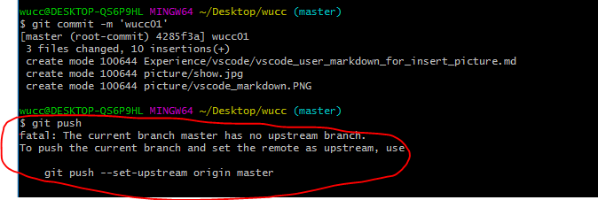

报错信息如下：
   
报错原因：
   在push代码时，出现“git master branch has no upstream branch”问题的原因是没有将本地的分支与远程仓库的分支进行关联， 出现这种情况主要是由于远程仓库太多，且分支较多。在默认情况下，git push时一般会上传到origin下的master分支上，然而当repository和branch过多，而又没有设置关联时，git就会产生疑问，因为它无法判断你的push目标。

Git 的 “master” 分支并不是一个特殊分支。 它就跟其它分支完全没有区别。 之所以几乎每一个仓库都有 master 分支，是因为git init命令默认创建它，并且大多数人都懒得去改动它

远程仓库名字 “origin” 与分支名字 “master” 一样，在 Git 中并没有任何特别的含义一样。origin” 是当你运行git clone时默认的远程仓库名字。 如果你运行 git clone -o booyah，那么你默认的远程分支名字将会是 booyah/master。

解决办法其实就是确定这两个值，方法有两种：

第一种如上图中的提示：git push --set-upstream origin master。其中的origin是你在clone远程代码时，git为你创建的指向这个远程代码库的标签，它指向repository。为了能清楚了解你要指向的repository，可以用命令git remote -v进行查看。master是你远程的branch，可以用git branch -a查看所有分支，远程分支是红色的部分。然后确定好这两个值后，将值换掉即可。
另一种方法是：git push -u origin master。同样根据自己的需要，替换origin和master。
两个命令的区别是第一条命令是要保证你的远程分支存在，如果不存在，也就无法进行关联。而第二条指令即使远程没有你要关联的分支，它也会自动创建一个出来，以实现关联。

原文链接：https://blog.csdn.net/benben_2015/article/details/78803753

第二个报错：
    

原因：修改了git的用户名或密码，如果你也修改后出现这种问题，在电脑中搜索凭证管理器，找到普通凭证把这条删除或者点编辑修改，再拉取或者提交的时候会让我们重新输入用户名密码 。
 如下图所示：
      